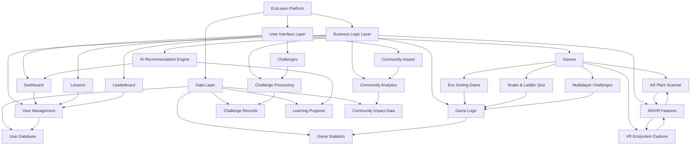

# EcoLearn Platform Architecture Flowchart

## Component Descriptions

### User Interface Layer
- **Dashboard**: Main user hub with statistics and recommendations
- **Games**: Interactive educational games with new AR/VR features
- **Challenges**: Environmental action challenges
- **Lessons**: Educational content modules
- **Community Impact**: Visualization of collective environmental impact
- **Leaderboard**: User ranking system

### Business Logic Layer
- **User Management**: Authentication and user profile handling
- **Game Logic**: Core mechanics for all games
- **Challenge Processing**: Challenge validation and scoring
- **AI Recommendation Engine**: Personalized content suggestions
- **AR/VR Features**: Augmented and virtual reality functionality
- **Community Analytics**: Data processing for impact visualization

### Data Layer
- **User Database**: Student and teacher information
- **Game Statistics**: Player scores and achievements
- **Challenge Records**: Completed challenges and impact data
- **Learning Progress**: Lesson completion and knowledge tracking
- **Community Impact Data**: Aggregated environmental action metrics

## Technology Stack

### Frontend Technologies
- **JSP**: Server-side rendering for dynamic content
- **JavaScript**: Client-side interactivity and features
- **Bootstrap 5**: Responsive design framework
- **Font Awesome**: Iconography
- **WebXR**: AR/VR capabilities

### Backend Technologies
- **Java Servlets**: Server-side processing
- **MySQL**: Database management
- **JDBC**: Database connectivity

### Enhanced Features Stack
- **AR/VR**: JavaScript-based computer vision and 3D rendering
- **AI**: Client-side recommendation algorithms
- **Real-time**: WebSocket-ready architecture for multiplayer
- **Data Visualization**: Charting libraries for impact metrics